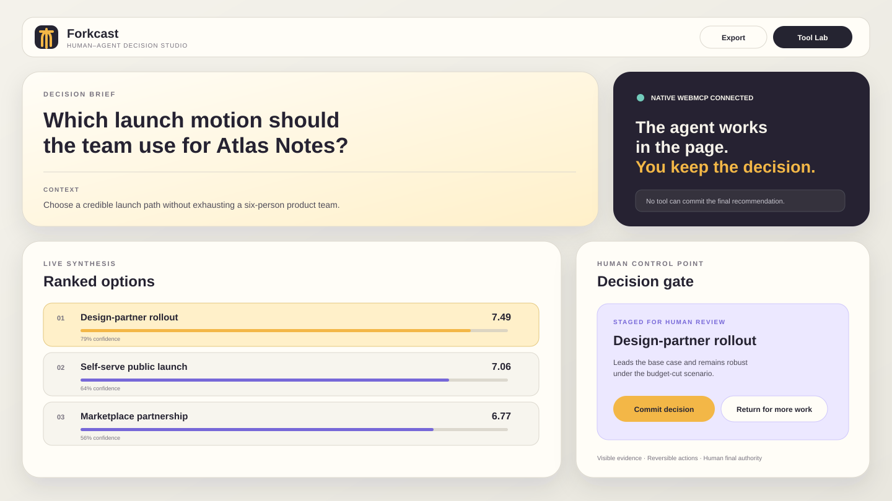
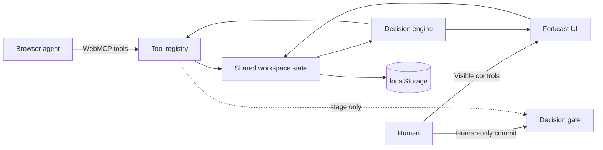

# Forkcast

**A human–agent decision studio built for WebMCP.**

Forkcast turns a browser page into a shared decision workspace. An agent can frame a decision, add alternatives, score evidence, create scenarios, run uncertainty simulations, and stage a recommendation through structured WebMCP tools. A person keeps control of the values and the final commitment.

> Decision intelligence, not decision replacement.

[](https://github.com/652036/forkcast/actions/workflows/ci.yml)
[](https://github.com/652036/forkcast/actions/workflows/pages.yml)
[](LICENSE)

<p align="center">
  
</p>

## Why Forkcast

Most AI decision tools hide the process inside a chat transcript. Forkcast makes the process inspectable:

- **The workspace is the source of truth.** Options, criteria, weights, evidence, scenarios, assumptions, and actions remain visible and editable.
- **Agent actions are structured.** WebMCP tools modify the same state a person sees instead of simulating clicks or returning prose that must be copied manually.
- **Uncertainty is explicit.** Every score carries confidence, open assumptions are tracked, and a seeded Monte Carlo stress test shows whether the apparent winner is robust.
- **The final decision stays human-controlled.** An agent may stage a recommendation, but Forkcast intentionally exposes no tool that commits it.
- **It works without a backend.** State stays in `localStorage`; the app has no runtime dependencies and works offline after the first visit.

## Demo in 60 seconds

1. Open the app and load the **Product launch** example.
2. Open **Tool Lab** and run `decision_read_workspace`.
3. Run `decision_find_evidence_gaps` to identify weak cells.
4. Run `decision_add_option` to add a partner-led launch.
5. Use `decision_score_option` to add evidence and confidence.
6. Create and activate a scenario, then adjust a weight.
7. Run `decision_run_stress_test` to compare outcomes across simulated futures.
8. Run `decision_stage_recommendation`.
9. Return to the visible **Decision gate**. Only the human-facing **Commit decision** button can finalize the choice.

A presenter-ready walkthrough is in [`docs/DEMO_SCRIPT.md`](docs/DEMO_SCRIPT.md).

## WebMCP tools

Forkcast registers 19 tools while a decision is open. After a human commits, only the four read/focus/export tools remain.

| Tool | Purpose | Mutation |
| --- | --- | --- |
| `decision_read_workspace` | Read the brief, matrix, ranking, gaps, assumptions, scenarios, and recommendation state | No |
| `decision_find_evidence_gaps` | Find cells with missing evidence or confidence below 55% | No |
| `decision_export_markdown` | Return a portable decision record | No |
| `decision_focus_view` | Bring a visible section into the human viewport | UI only |
| `decision_define_brief` | Set the title, question, context, or constraints | Yes |
| `decision_add_option` | Add an alternative and initialize neutral score cells | Yes |
| `decision_update_option` | Rename or clarify an existing alternative | Yes |
| `decision_remove_option` | Remove an option after explicit confirmation | Yes |
| `decision_add_criterion` | Add a weighted decision value | Yes |
| `decision_set_criterion_weight` | Adjust a value in the base case or a scenario | Yes |
| `decision_score_option` | Record a score, confidence, and evidence note | Yes |
| `decision_add_assumption` | Add a visible unknown to the assumption ledger | Yes |
| `decision_set_assumption_status` | Mark an assumption open, testing, validated, or invalidated | Yes |
| `decision_create_scenario` | Create a what-if future | Yes |
| `decision_activate_scenario` | Switch the visible workspace to a scenario | Yes |
| `decision_run_stress_test` | Run and save deterministic Monte Carlo results | Yes |
| `decision_stage_recommendation` | Stage a choice and rationale for human review | Yes |
| `decision_clear_staged_recommendation` | Return a staged recommendation for more work | Yes |
| `decision_undo_last_change` | Undo the latest visible mutation | Yes |

Tools use strict JSON Schemas, WebMCP annotations, and abort signals. Read-only tools carry `readOnlyHint`. Tools that return or process user-authored workspace content carry `untrustedContentHint`.

### Human-control boundary

The browser agent can call `decision_stage_recommendation`, but there is deliberately **no** `decision_commit`, `decision_finalize`, or equivalent tool. Finalization requires a person to check the visible review confirmation and press **Commit decision**. Once committed, mutation tools are removed from the registered tool set.

## Architecture



```text
.
├── index.html                  # Accessible application shell and dialogs
├── styles.css                 # Responsive light/dark visual system
├── sw.js                      # Offline app-shell cache
├── src/
│   ├── app.js                 # State, UI, handlers, and WebMCP tool definitions
│   ├── data.js                # Blank workspace and realistic examples
│   ├── engine.js              # Ranking, scenarios, stress test, and exports
│   └── webmcp.js              # Native registration, validation, and preview bridge
├── tests/                     # Deterministic engine and schema-validation tests
├── scripts/                   # Zero-dependency server, build, and validation
└── docs/                      # Architecture, demo, and submission copy
```

More detail is available in [`docs/ARCHITECTURE.md`](docs/ARCHITECTURE.md).

## Run locally

Forkcast has no package dependencies. Node is used only for the local server, validation, and tests.

```bash
git clone https://github.com/652036/forkcast.git
cd forkcast
npm ci
npm run dev
```

Open `http://127.0.0.1:4173`.

For native WebMCP local development in Chrome, enable `chrome://flags/#enable-webmcp-testing`, relaunch, and use the included server. It sends the origin-isolation and `tools` permissions-policy headers expected by the API. In an ordinary browser, Forkcast falls back to the built-in Tool Lab and exposes the same tool list at `window.__forkcastWebMCP`.

```js
window.__forkcastWebMCP.listTools();
await window.__forkcastWebMCP.executeTool('decision_read_workspace', {});
window.__forkcastWebMCP.status();
```

## Verify and build

```bash
npm run verify
npm run build
```

Verification performs JavaScript syntax checks, validates required UI anchors, detects duplicate ids, checks local-only assets and PWA metadata, enforces the no-agent-commit safety invariant, and runs the decision-engine and schema-validation test suites.

## Decision model

For option `o`, criterion `c`, and active scenario `s`:

```text
weighted_score(o, s) = Σ normalized_weight(c, s) × score(o, c, s)
```

Confidence is aggregated with the same normalized weights. Scenario overrides are sparse layers over the base case and never mutate it.

The stress test perturbs both weights and scores. Score variance grows as confidence falls. Results include win rate, expected score, and P10–P90 range for every option. A seeded random generator keeps demonstrations and tests reproducible.

## Privacy and safety

- No analytics, cookies, account system, remote database, model key, or third-party JavaScript.
- Workspace state is saved only in the browser’s `localStorage` unless the user exports it.
- User-authored evidence is treated as untrusted content in tool metadata.
- Destructive option removal requires `confirm: true` and remains undoable.
- A restrictive Content Security Policy limits resource loading.
- Agent recommendations are staged; human confirmation is mandatory for commitment.

See [`SECURITY.md`](SECURITY.md) for the trust boundaries.

## Deployment

The repository includes a GitHub Pages workflow. Set **Settings → Pages → Build and deployment → Source** to **GitHub Actions** once. Every later push to `main` verifies and deploys the static site.

Expected Pages URL after enablement: `https://652036.github.io/forkcast/`

## Challenge materials

- [`docs/DEVPOST_SUBMISSION.md`](docs/DEVPOST_SUBMISSION.md) — submission draft and judging narrative
- [`docs/DEMO_SCRIPT.md`](docs/DEMO_SCRIPT.md) — 2–3 minute demo script
- [`docs/ARCHITECTURE.md`](docs/ARCHITECTURE.md) — state model, tool lifecycle, and trust boundary

## License

MIT — see [`LICENSE`](LICENSE).
