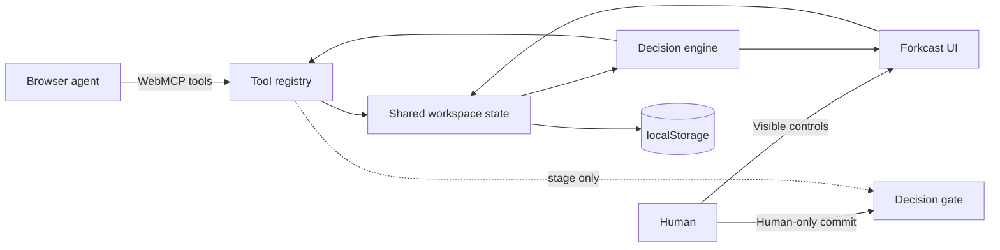

# Forkcast

**A human–agent decision studio built for WebMCP.**

Forkcast turns a browser page into a shared decision workspace. An agent can frame a decision, add alternatives, score evidence, create scenarios, run uncertainty simulations, and stage a recommendation through structured WebMCP tools. A person keeps control of the values and the final commitment.

> Decision intelligence, not decision replacement.

[](https://github.com/652036/web-mcp/actions/workflows/ci.yml)
[](https://github.com/652036/web-mcp/actions/workflows/pages.yml)
[](LICENSE)

## Why Forkcast

Most AI decision tools hide the process inside a chat transcript. Forkcast makes the process inspectable:

- **The workspace is the source of truth.** Options, criteria, weights, evidence, scenarios, and assumptions remain visible and editable.
- **Agent actions are structured.** WebMCP tools modify the same state a person sees rather than simulating clicks or returning prose that must be copied manually.
- **Uncertainty is explicit.** Scores carry confidence, open assumptions are tracked, and a seeded Monte Carlo stress test shows whether the apparent winner is robust.
- **The final decision stays human-controlled.** An agent may stage a recommendation, but Forkcast intentionally exposes no tool that commits it.
- **It works without a backend.** State stays in `localStorage`; the app has no external runtime dependencies and can work offline after the first load.

## Demo in 60 seconds

1. Open the app and load the **Product launch** example.
2. Open **Tool Lab** and run `decision_read_workspace`.
3. Run `decision_add_option` to add a partner-led launch.
4. Use `decision_score_option` and `decision_add_assumption` to add evidence and uncertainty.
5. Create a budget-cut scenario and activate it.
6. Run `decision_run_stress_test` to compare outcomes across simulated futures.
7. Run `decision_stage_recommendation`.
8. Return to the visible **Decision gate**. Only the human-facing **Commit decision** button can finalize the choice.

A longer presenter script is in [`docs/DEMO_SCRIPT.md`](docs/DEMO_SCRIPT.md).

## WebMCP tools

Forkcast dynamically registers only tools that make sense for the current workspace.

| Tool | Purpose | Mutation |
| --- | --- | --- |
| `decision_read_workspace` | Read the brief, matrix, ranking, assumptions, scenarios, and recommendation state | No |
| `decision_define_brief` | Set the title, question, context, or constraints | Yes |
| `decision_add_option` | Add an alternative and initialize neutral score cells | Yes |
| `decision_update_option` | Rename or clarify an existing alternative | Yes |
| `decision_remove_option` | Remove an option after explicit confirmation | Yes |
| `decision_add_criterion` | Add a weighted decision value | Yes |
| `decision_set_criterion_weight` | Adjust a value in the base case or active scenario | Yes |
| `decision_score_option` | Record a score, confidence, and evidence note | Yes |
| `decision_add_assumption` | Add a visible unknown to the assumption ledger | Yes |
| `decision_create_scenario` | Create a what-if future with weight and score overrides | Yes |
| `decision_activate_scenario` | Switch the visible workspace to a scenario | Yes |
| `decision_run_stress_test` | Run deterministic Monte Carlo simulations | Analysis only |
| `decision_stage_recommendation` | Stage a choice and rationale for human review | Yes |
| `decision_clear_staged_recommendation` | Send a staged recommendation back for more work | Yes |
| `decision_undo_last_change` | Undo the latest visible mutation | Yes |
| `decision_focus_view` | Bring a section of the page into view | UI only |
| `decision_export_markdown` | Return a portable decision record | No |

Tools use JSON Schema, WebMCP annotations, and abort signals. Read-only tools are marked with `readOnlyHint`. Tools that may return or process user-authored workspace content carry `untrustedContentHint`.

### Human-control boundary

The browser agent can call `decision_stage_recommendation`, but there is deliberately **no** `decision_commit`, `decision_finalize`, or equivalent tool. Finalization requires a person to press the visible button inside the Decision gate. This boundary is also described in the tool interface so the agent can plan around it.

## Architecture



The code is intentionally small and reviewable:

```text
.
├── index.html                  # Accessible application shell and dialogs
├── styles.css                 # Responsive visual system
├── sw.js                      # Offline app-shell cache
├── src/
│   ├── app.js                 # State, UI, event handlers, and WebMCP tool definitions
│   ├── data.js                # Blank workspace and example decisions
│   ├── engine.js              # Ranking, scenarios, stress test, and exports
│   └── webmcp.js              # Native registration plus local preview bridge
├── tests/engine.test.mjs      # Deterministic decision-engine tests
├── scripts/                   # Zero-dependency local server and validation
└── docs/                      # Demo, architecture, and submission notes
```

## Run locally

Forkcast has no package dependencies. Node is used only for the local server and tests.

```bash
git clone https://github.com/652036/web-mcp.git
cd web-mcp
npm run dev
```

Open `http://127.0.0.1:4173`.

For browser-native WebMCP local development in Chrome, enable `chrome://flags/#enable-webmcp-testing`, relaunch the browser, and use the included server. It sends the origin-isolation and `tools` permissions-policy headers expected by the API. In any normal browser, Forkcast automatically falls back to the built-in Tool Lab and exposes the same tool list at `window.__forkcastWebMCP` for development and judging.

## Verify

```bash
npm run verify
```

This performs JavaScript syntax checks, validates required application element IDs and the PWA manifest, then runs the decision-engine test suite.

## Preview bridge

The fallback API is intentionally tiny:

```js
window.__forkcastWebMCP.listTools();
await window.__forkcastWebMCP.executeTool('decision_read_workspace', {});
window.__forkcastWebMCP.status();
```

The preview bridge is not a replacement for WebMCP. It makes the project easy to inspect on browsers where the experimental API is unavailable while keeping native registration as the preferred path.

## Decision model

For option \(o\), criteria \(c\), and active scenario \(s\):

```text
weighted_score(o, s) = Σ normalized_weight(c, s) × score(o, c, s)
```

Confidence is aggregated with the same normalized weights. Scenario overrides are layered over the base case and never mutate it.

The stress test perturbs criterion weights and option scores. Score variance grows when confidence is low. Results include win rate, expected score, and P10–P90 range for each option. A deterministic seeded random generator keeps demonstrations and tests reproducible.

## Privacy and safety

- No analytics, cookies, account system, remote database, or model key.
- Workspace state is saved only in the browser’s `localStorage` unless the user exports it.
- User-authored evidence is treated as untrusted content in tool metadata.
- Destructive option removal requires `confirm: true` and remains undoable.
- Agent recommendations are staged; human confirmation is mandatory for commitment.

## Deployment

The repository includes a GitHub Pages workflow. In repository settings, set **Pages → Build and deployment → Source** to **GitHub Actions** once. Every push to `main` will then deploy the static site.

## Challenge materials

- [`docs/DEVPOST_SUBMISSION.md`](docs/DEVPOST_SUBMISSION.md) — submission copy and judging notes
- [`docs/DEMO_SCRIPT.md`](docs/DEMO_SCRIPT.md) — 2–3 minute demo script
- [`docs/ARCHITECTURE.md`](docs/ARCHITECTURE.md) — state model, WebMCP lifecycle, and trust boundary

## License

MIT — see [`LICENSE`](LICENSE).
