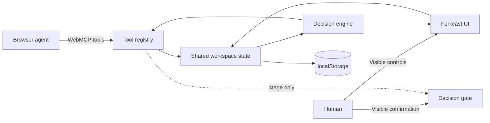

# Forkcast

**A human–agent decision studio built for WebMCP.**

Forkcast turns a browser page into a shared decision workspace. An agent can frame a decision, add alternatives, score evidence, create scenarios, run uncertainty simulations, and stage a recommendation through structured WebMCP tools. The site-tool surface stops at staging; finalization is reserved for the visible review control and explicit user confirmation.

> Decision intelligence, not decision replacement.

[](https://github.com/652036/forkcast/actions/workflows/ci.yml)
[](https://github.com/652036/forkcast/actions/workflows/pages.yml)
[](LICENSE)

<p align="center">
  
</p>

## Why Forkcast

Most AI decision tools hide the process inside a chat transcript. Forkcast makes the process inspectable:

- **The workspace is the source of truth.** Options, criteria, weights, evidence, scenarios, assumptions, and actions remain visible and editable.
- **Agent actions are structured.** WebMCP tools modify the same state a person sees instead of simulating clicks or returning prose that must be copied manually.
- **Uncertainty is explicit.** Every score carries confidence, open assumptions are tracked, and a seeded Monte Carlo stress test shows whether the apparent winner is robust.
- **The tool authority stops at staging.** Forkcast exposes no WebMCP tool that commits a recommendation; finalization uses a visible review control and explicit user confirmation.
- **It works without a backend.** State stays in `localStorage`; the app has no runtime dependencies and works offline after the first visit.

## How judges can verify native WebMCP (60 seconds)

**Browser requirement.** WebMCP is behind a flag today. Use Chrome 150 or newer with `chrome://flags/#enable-webmcp-testing` set to *Enabled* (relaunch afterwards), or open the production URL inside the ChatGPT in-app browser. Without either, the badge in the top-right card reads **Tool Lab preview** and its second line tells you exactly what to enable.

1. Open <https://forkcast.st2p8g4tkf.chatgpt.site/>. The badge should read **Native WebMCP connected · 19 tools**.
2. Load the **Product launch** example from the header, then paste these prompts to the browser agent one at a time:
   - “Read this Forkcast workspace and identify the two weakest evidence cells. Do not change anything yet.”
   - “Add ‘Partner-led launch’ as an alternative. Score it 7.5 on the first criterion at 65 percent confidence with evidence ‘Partner committed to a four-week pilot; onboarding capacity is unverified,’ then show me the matrix.”
   - “Stage the current leader with a concise rationale for my review.”
3. Watch the matrix, ranking, “Last shared action” card, and audit trail update on the page after each call.
4. Tick the review checkbox in the **Decision gate** and press **Commit decision** yourself. The badge drops from **19 tools** to **4 tools**: every write tool is unregistered and only read/focus/export remain. There is no commit tool for the agent to call.

**Fallback path.** If native registration is unavailable, open **Tool Lab** in the header. It runs the identical schemas and handlers through the same validation, so every step above can be reproduced deterministically; the badge text and `window.__forkcastWebMCP.status()` report why native mode is off. The full 2:43 walkthrough is in [`docs/DEMO_SCRIPT.md`](docs/DEMO_SCRIPT.md).

<!-- ORIGIN TRIAL: to let judges use native WebMCP in Chrome without the flag, request a WebMCP origin-trial token for https://forkcast.st2p8g4tkf.chatgpt.site and insert `<meta http-equiv="origin-trial" content="TOKEN">` in index.html <head>, directly below the CSP meta tag. The token is origin-bound and must be requested manually. -->

## Demo in 60 seconds

1. Open the app and load the **Product launch** example.
2. Confirm **Native WebMCP connected**, then ask the browser agent: “Read this workspace and identify the two weakest evidence cells. Do not change anything.”
3. Ask it to add and score a partner-led launch; watch the matrix, ranking, latest shared action, and audit trail update on the page.
4. Ask it to run a seeded 2,000-iteration stress test and summarize whether the leader is robust.
5. Ask it to stage the current leader for review.
6. Return to the visible **Decision gate**. Confirm the review checkbox, then use **Commit decision**; the WebMCP surface exposes no finalize operation.

A presenter-ready walkthrough is in [`docs/DEMO_SCRIPT.md`](docs/DEMO_SCRIPT.md).

## WebMCP tools

Forkcast registers a stable set of 19 tools while a decision is open. Preconditions that are not met (nothing staged to clear, no agent change to undo, only one option left) return a readable error instead of making the tool disappear, so the registry never churns underneath an in-flight call. The single dynamic change is authority narrowing: after explicit confirmation commits the decision, the 15 write tools are unregistered and only the four read/focus/export tools remain.

| Tool | Purpose | Mutation |
| --- | --- | --- |
| `decision_read_workspace` | Read the overview (summary, full ranking, criteria weights) or page through one section: brief, options, criteria, matrix, evidence, assumptions, scenarios, overrides, recommendation, stress test, activity | No |
| `decision_find_evidence_gaps` | Find active-scenario cells with missing evidence or confidence below 55% | No |
| `decision_export_markdown` | Page through a portable Markdown record in bounded character slices | No |
| `decision_focus_view` | Bring a visible section into the human viewport | UI only |
| `decision_define_brief` | Set the title, question, context, or constraints | Yes |
| `decision_add_option` | Add an alternative and initialize neutral score cells | Yes |
| `decision_update_option` | Rename or clarify an existing alternative | Yes |
| `decision_remove_option` | Remove an option; the activity trail keeps its name and score snapshot, and undo restores it | Yes |
| `decision_add_criterion` | Add a weighted decision value | Yes |
| `decision_set_criterion_weight` | Adjust a value in the base case or a scenario | Yes |
| `decision_score_option` | Record a score, confidence, and evidence note | Yes |
| `decision_add_assumption` | Add a visible unknown to the assumption ledger | Yes |
| `decision_set_assumption_status` | Mark an assumption open, testing, validated, or invalidated | Yes |
| `decision_create_scenario` | Create a what-if future | Yes |
| `decision_activate_scenario` | Switch the visible workspace to a scenario | Yes |
| `decision_run_stress_test` | Run and save deterministic Monte Carlo results | Yes |
| `decision_stage_recommendation` | Stage a choice and rationale for human review | Yes |
| `decision_clear_staged_recommendation` | Return a staged recommendation for more work | Yes |
| `decision_undo_last_change` | Undo the latest mutation only when it belongs to the agent | Yes |

Tools use closed JSON Schemas with field descriptions and bounds. Pure reads carry the current WebMCP `readOnlyHint`; outputs that can contain workspace-authored text carry `untrustedContentHint`. Native registration targets `document.modelContext.registerTool()` and awaits every registration promise. Each tool owns its own `AbortController`: a refresh diffs the desired set by name and definition fingerprint, aborts only tools that disappeared or changed, registers only tools that are new or changed, and leaves everything else untouched. Refreshes requested while a tool call is executing are applied after that call returns, so a handler can never cancel its own invocation (older Chrome builds cancel in-progress calls when their tool is unregistered).

Native handlers return ordinary structured values; validation, cancellation, and domain failures reject their promises through WebMCP. The local Tool Lab invokes the same validated handlers and separately formats values or thrown errors for rehearsal and debugging.

Read tools page each section independently: `overview` returns the summary plus the complete ranking and every criterion weight in one call; other sections (`brief`, `options`, `criteria`, `matrix`, `evidence`, `assumptions`, `scenarios`, `scenario-overrides`, `recommendation`, `stress-test`, `activity`) default to 8 items per page and accept up to 25. Pages shrink automatically to stay under 12,000 serialized characters, long text is split into numbered fragments, and every page reports the `scenarioId` it reflects; `nextCursor` is `null` when that section is fully read. Markdown export defaults to 4,000 characters and never returns more than 6,000 per slice.

### Visible confirmation boundary

The browser agent can call `decision_stage_recommendation`, but the Forkcast WebMCP surface deliberately provides **no** `decision_commit`, `decision_finalize`, or equivalent tool. Finalization is reserved for the visible review checkbox, **Commit decision** control, and explicit user confirmation. Once committed, WebMCP mutation tools and visible editing controls are disabled or removed. The person may explicitly use **Undo last change** to reopen their own commit; the agent cannot undo a commit or cross a newer human edit.

## Architecture



```text
.
├── index.html                  # Accessible application shell and dialogs
├── styles.css                 # Responsive light/dark visual system
├── sw.js                      # Network-first app shell with offline fallback
├── src/
│   ├── app.js                 # State, UI, human handlers, and the tool host adapter
│   ├── data.js                # Blank workspace and realistic examples
│   ├── engine.js              # Bounded state, ranking, paged reads, stress test, and exports
│   ├── storage.js             # Transactional local persistence and diagnostics
│   ├── tools.js               # WebMCP tool definitions against a DOM-free host interface
│   └── webmcp.js              # Per-tool native lifecycle, validation, direct values, preview bridge
├── tests/                     # Engine, tool, validation, storage, and native registry lifecycle tests
├── scripts/                   # Zero-dependency server, build, smoke test, and validation
└── docs/                      # Architecture, demo, and submission copy
```

More detail is available in [`docs/ARCHITECTURE.md`](docs/ARCHITECTURE.md).

## Run locally

Forkcast has no package dependencies. Node is used only for the local server, validation, and tests.

```bash
git clone https://github.com/652036/forkcast.git
cd forkcast
npm ci
npm run dev
```

Open `http://127.0.0.1:4173`.

For native WebMCP local development in Chrome, enable `chrome://flags/#enable-webmcp-testing`, relaunch, and use the included server. The adapter looks for `document.modelContext` first and falls back to `navigator.modelContext` for older builds. In an ordinary browser, Forkcast falls back to the built-in Tool Lab, shows the enablement hint in the status badge, and exposes the same tool list at `window.__forkcastWebMCP`.

```js
window.__forkcastWebMCP.listTools();
await window.__forkcastWebMCP.executeTool('decision_read_workspace', {});
window.__forkcastWebMCP.status();
```

## Verify and build

```bash
npm run verify
```

`npm run verify` syntax-checks the source, validates accessible UI anchors and the optional deployment headers file, enforces the no-WebMCP-commit invariant, runs the engine/schema/native-lifecycle tests, builds `dist/`, and smoke-tests the built output over HTTP with the local server. `npm run build` remains available when only a fresh static bundle is needed, and `npm run check:prod` verifies the live production deployment (network access required; not part of `verify`).

## Decision model

For option `o`, criterion `c`, and active scenario `s`:

```text
weighted_score(o, s) = Σ normalized_weight(c, s) × score(o, c, s)
```

Confidence is aggregated with the same normalized weights. Scenario overrides are sparse layers over the base case and never mutate it.

The stress test perturbs both weights and scores. Score variance grows as confidence falls. Results include win rate, expected score, and P10–P90 range for every option. A seeded random generator keeps demonstrations and tests reproducible; execution yields between chunks and checks the call’s `AbortSignal` throughout.

## Privacy and safety

- No analytics, cookies, account system, remote database, model key, or third-party JavaScript.
- Workspace state is saved only in the browser’s `localStorage` unless the user exports it. **Export .md** downloads the decision record, **Export .json** downloads the full workspace, and **Import** restores a JSON export after validation and confirmation.
- Writes persist before state and undo history are committed, so storage failure is a diagnostic, atomic no-op. If saved data is unreadable, Forkcast opens the built-in example and shows a visible, dismissible notice instead of failing silently.
- Hydration validates the workspace version and shape, caps collections and text, and drops references to unknown ids.
- User-authored evidence is treated as untrusted content in tool metadata.
- Option removal is undoable and leaves a traceable activity entry with the removed option’s name and score snapshot, instead of a ceremonial `confirm` flag an agent would set reflexively.
- Agent undo cannot roll back a newer human-authored change.
- A restrictive Content Security Policy limits resource loading.
- WebMCP recommendations are staged; commitment uses the visible review control and explicit user confirmation.

See [`SECURITY.md`](SECURITY.md) for the trust boundaries.

## Deployment

Production WebMCP URL: <https://forkcast.st2p8g4tkf.chatgpt.site/>

The production host (ChatGPT Sites, `*.chatgpt.site`) serves `dist/` as static files and does not support custom response headers, so `_headers` is not applied there. Native WebMCP does not depend on it: in a top-level document the `tools` permissions policy defaults to `self`, and origin-keyed agent clustering is the browser default. `_headers` (CSP, `Origin-Agent-Cluster: ?1`, `Permissions-Policy: tools=(self)`, `X-Frame-Options: DENY`, `frame-ancestors 'none'`) is provided for hosts that read it, such as Netlify or Cloudflare Pages; the local dev server sends the same headers. Framing protection on ChatGPT Sites therefore relies on the runtime guard: an embedded copy of the page never registers native tools.

`npm run check:prod` fetches the production URL, asserts that the page, `sw.js`, and `src/app.js` are reachable, and byte-compares the deployed `src/app.js` with the local file so a stale deployment is caught before a demo.

The repository also publishes a GitHub Pages preview at <https://652036.github.io/forkcast/>. Pages ignores `_headers` as well, so use that URL for the visual app and Tool Lab unless native registration is independently verified there. The submission uses the production URL above.

Implementation references: the current [WebMCP specification](https://github.com/webmachinelearning/webmcp) and Chrome’s [imperative WebMCP guidance](https://developer.chrome.com/docs/ai/webmcp/imperative-api).

## Challenge materials

- [`docs/DEVPOST_SUBMISSION.md`](docs/DEVPOST_SUBMISSION.md) — submission draft and judging narrative
- [`docs/DEMO_SCRIPT.md`](docs/DEMO_SCRIPT.md) — timed 2:43 native-agent demo script
- [`docs/ARCHITECTURE.md`](docs/ARCHITECTURE.md) — state model, tool lifecycle, and trust boundary

## License

MIT — see [`LICENSE`](LICENSE).
