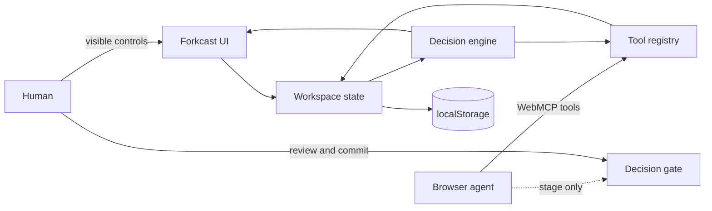

# Forkcast architecture

## Design goal

Forkcast is not a chat interface wrapped around a scorecard. It is a shared browser workspace where a person and an agent operate on the same inspectable state.



## Modules

- `src/engine.js` contains bounded workspace hydration, deterministic scoring, scenario layering, paged reads, gap detection, chunked Monte Carlo stress testing, and Markdown export.
- `src/data.js` contains a blank workspace and two realistic examples.
- `src/storage.js` persists a candidate snapshot before state or undo history is committed, making storage failure an atomic, diagnosable no-op.
- `src/webmcp.js` validates inputs, manages the asynchronous native registry, returns ordinary structured values, and exposes the same definitions through the Tool Lab fallback.
- `src/app.js` owns state transitions, visible controls, tool handlers, persistence, activity history, and the visible confirmation gate.

## State model

The base case stores options, criteria, and score cells. A scenario contains sparse `weightOverrides` and `scoreOverrides`. Reads layer a scenario over the base case without mutating base evidence.

Each score cell records:

```json
{
  "score": 7.5,
  "confidence": 65,
  "evidence": "Pilot interviews and comparable launch data."
}
```

Confidence affects the simulation rather than merely decorating the UI. Lower-confidence scores receive a wider perturbation in the stress test. Rankings, matrix cells, and evidence gaps all resolve against the same active scenario, so the human and agent never analyze different layers by accident.

## Tool lifecycle

`installWebMCP()` targets the current top-level `document.modelContext` API and otherwise enables the local Tool Lab. Native `registerTool()` promises are awaited before the UI reports a connection. Registration rejection removes any partial tool set and surfaces a Tool Lab fallback instead of producing an unhandled rejection.

Every registration receives an `AbortSignal`. A stable fingerprint excludes handler identity, so ordinary state changes update handler references without unregistering content-equivalent tools. When actual availability changes, the old controller is aborted before the new context-aware set is registered. Tools disappear when their preconditions do not hold—for example, clear without a staged recommendation or remove with one option—and all mutation tools disappear after commitment.

Native and preview execution share the same handlers and closed JSON Schemas. Native execution returns the handler’s ordinary structured value, while validation, cancellation, and domain errors reject the promise. The Tool Lab separately formats those values or errors for display. Only the current WebMCP annotation fields are emitted: `readOnlyHint` for pure reads and `untrustedContentHint` for workspace-authored output.

Workspace reads return one cursor-paged item at a time. Long fields become numbered 700-character fragments, the default overview is capped at 1,500 serialized characters, and every page is hard-limited to 3,000 serialized characters. Markdown export defaults to 1,500 characters and accepts at most 1,800 before automatically shrinking for JSON escaping. Following `nextCursor` and `fragmentIndex` preserves access to the full model. Stress testing yields between chunks and checks the call `AbortSignal` before and during the simulation.

## Visible confirmation boundary

An agent may:

- define the brief;
- add and edit options or criteria;
- record scores, confidence, and evidence;
- create and activate scenarios;
- manage assumptions;
- run a stress test;
- stage or clear a recommendation.

The Forkcast WebMCP surface cannot commit a final decision: no `decision_commit`, `decision_finalize`, or equivalent site tool exists. Finalization is reserved for the visible review checkbox, **Commit decision** control, and explicit user confirmation. After commitment, mutation tools disappear and editing controls become disabled. A person may explicitly use **Undo last change** to reopen their own commit; agent undo is absent after commitment and cannot cross a newer human edit.

## Local-first storage

The workspace is serialized to `localStorage`. Hydration normalizes the current version, required structure, ids, references, collection sizes, numeric ranges, and text lengths. A mutation is persisted before the in-memory workspace or undo history changes; quota/private-mode failures therefore preserve the prior snapshot and return a useful diagnostic. There is no model key, account, database, analytics endpoint, or third-party runtime. The service worker caches the application shell for offline use after the first visit.

## Deployment contract

Native WebMCP requires an origin-keyed agent cluster and permission to use the `tools` feature. The development server and production configuration explicitly send `Origin-Agent-Cluster: ?1` and `Permissions-Policy: tools=(self)` instead of relying on browser defaults. `npm run verify` builds the site and performs a real HTTP smoke test that asserts this deployment contract before a release is considered valid.
