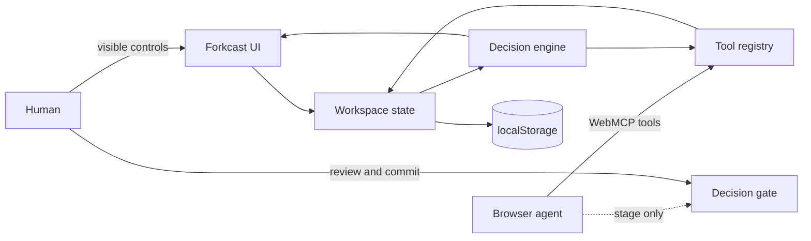

# Forkcast architecture

## Design goal

Forkcast is not a chat interface wrapped around a scorecard. It is a shared browser workspace where a person and an agent operate on the same inspectable state.



## Modules

- `src/engine.js` contains bounded workspace hydration, deterministic scoring, scenario layering, paged reads, gap detection, chunked Monte Carlo stress testing, and Markdown export.
- `src/data.js` contains a blank workspace and two realistic examples.
- `src/storage.js` persists a candidate snapshot before state or undo history is committed, making storage failure an atomic, diagnosable no-op.
- `src/tools.js` defines every WebMCP tool against a small host interface (`getWorkspace`, `getUndoStack`, `mutate`, `undo`, `focus`), so the tool layer is testable in Node without a DOM.
- `src/webmcp.js` validates inputs, manages the per-tool native registry, returns ordinary structured values, and exposes the same definitions through the Tool Lab fallback.
- `src/app.js` owns state transitions, visible controls, human handlers, persistence, activity history, the visible confirmation gate, and the host adapter that binds `tools.js` to page state.

## State model

The base case stores options, criteria, and score cells. A scenario contains sparse `weightOverrides` and `scoreOverrides`. Reads layer a scenario over the base case without mutating base evidence.

Each score cell records:

```json
{
  "score": 7.5,
  "confidence": 65,
  "evidence": "Pilot interviews and comparable launch data."
}
```

Confidence affects the simulation rather than merely decorating the UI. Lower-confidence scores receive a wider perturbation in the stress test. Rankings, matrix cells, and evidence gaps all resolve against the same active scenario, so the human and agent never analyze different layers by accident.

## Tool lifecycle

`installWebMCP()` targets the current top-level `document.modelContext` API (falling back to `navigator.modelContext` on older builds) and otherwise enables the local Tool Lab, with the status badge explaining how to enable native mode or why it is unavailable (for example, when the page is embedded in a frame). Native `registerTool()` promises are awaited before the UI reports a connection. Registration rejection removes any partial tool set and surfaces a Tool Lab fallback instead of producing an unhandled rejection.

Every tool owns its own `AbortController`. A refresh diffs the desired set against the registry by name and by a fingerprint of `name`, `title`, `description`, `inputSchema`, and `annotations` (handler identity is excluded): tools that disappeared or changed are aborted, tools that are new or changed are registered, and content-equivalent tools keep their original registration. A registration that rejects because it was intentionally aborted is not treated as a failure. Refreshes requested while a tool call is executing are queued and applied on a fresh task after the call settles, so a handler's own state change can never cancel its in-progress invocation.

Tool availability is deliberately stable. Preconditions that do not hold—clear without a staged recommendation, undo when the latest change is human, remove with a single option—return readable errors rather than removing the tool. The only dynamic change is authority narrowing: after commitment all write tools are unregistered and the four read/focus/export tools remain.

Native and preview execution share the same handlers and closed JSON Schemas. Native execution returns the handler’s ordinary structured value, while validation, cancellation, and domain errors reject the promise. The Tool Lab separately formats those values or errors for display. Only the current WebMCP annotation fields are emitted: `readOnlyHint` for pure reads and `untrustedContentHint` for workspace-authored output.

Workspace reads are cursor-paged per section. The `overview` section returns the summary, the complete ranking, and every criterion with its normalized weight (labels truncated to 60 characters; the `options` and `criteria` sections carry full text). Other sections default to 8 items per page and accept up to 25; a page shrinks item by item until it fits the 12,000-character serialized budget, so `nextCursor` always resumes exactly where the previous page stopped. The compact `matrix` section lists `{optionId, criterionId, score, confidence, hasEvidence}` cells, while `evidence` carries the evidence text as numbered 700-character fragments. Every page reports the `scenarioId` it reflects. Markdown export defaults to 4,000 characters and accepts at most 6,000 before automatically shrinking for JSON escaping. Stress testing yields between chunks and checks the call `AbortSignal` before and during the simulation.

## Visible confirmation boundary

An agent may:

- define the brief;
- add and edit options or criteria;
- record scores, confidence, and evidence;
- create and activate scenarios;
- manage assumptions;
- run a stress test;
- stage or clear a recommendation.

The Forkcast WebMCP surface cannot commit a final decision: no `decision_commit`, `decision_finalize`, or equivalent site tool exists. Finalization is reserved for the visible review checkbox, **Commit decision** control, and explicit user confirmation. After commitment, mutation tools disappear and editing controls become disabled. A person may explicitly use **Undo last change** to reopen their own commit; agent undo is absent after commitment and cannot cross a newer human edit.

## Local-first storage

The workspace is serialized to `localStorage`. Hydration normalizes the current version, required structure, ids, references, collection sizes, numeric ranges, and text lengths. A mutation is persisted before the in-memory workspace or undo history changes; quota/private-mode failures therefore preserve the prior snapshot and return a useful diagnostic. There is no model key, account, database, analytics endpoint, or third-party runtime. The service worker keeps a network-first copy of the application shell: same-origin scripts, styles, and the document are fetched from the network on every load and the cache is only an offline fallback, so a redeploy reaches returning visitors on their next navigation. The worker activates immediately but does not claim already-open pages, so a session never mixes old and new modules.

## Deployment contract

Native WebMCP requires a top-level document with permission to use the `tools` feature. Both requirements are met by browser defaults: `tools` defaults to `self` for the top-level document and agent clusters are origin-keyed by default. The production host (ChatGPT Sites) does not support custom response headers, so Forkcast does not depend on any. The `_headers` file (CSP, `Origin-Agent-Cluster: ?1`, `Permissions-Policy: tools=(self)`, anti-framing headers) is an optional hardening layer for hosts that read it, such as Netlify or Cloudflare Pages, and the local development server emits the same headers. Because `frame-ancestors` cannot be delivered from a `<meta>` CSP, the runtime additionally refuses native registration when the page is embedded in a frame.

`npm run verify` builds the site and smoke-tests the built output through the local server. `npm run check:prod` separately fetches the live production URL and byte-compares the deployed `src/app.js` with the repository so a stale deployment is visible before a demo.
