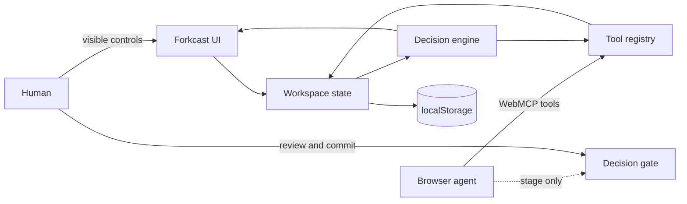

# Forkcast architecture

## Design goal

Forkcast is not a chat interface wrapped around a scorecard. It is a shared browser workspace where a person and an agent operate on the same inspectable state.



## Modules

- `src/engine.js` contains deterministic scoring, scenario layering, gap detection, Monte Carlo stress testing, workspace summarization, and Markdown export.
- `src/data.js` contains a blank workspace and two realistic examples.
- `src/webmcp.js` validates tool inputs, registers native WebMCP tools, and exposes the same definitions through the Tool Lab fallback.
- `src/app.js` owns state transitions, visible controls, tool handlers, persistence, activity history, and the human-only decision gate.

## State model

The base case stores options, criteria, and score cells. A scenario contains sparse `weightOverrides` and `scoreOverrides`. Reads layer a scenario over the base case without mutating base evidence.

Each score cell records:

```json
{
  "score": 7.5,
  "confidence": 65,
  "evidence": "Pilot interviews and comparable launch data."
}
```

Confidence affects the simulation rather than merely decorating the UI. Lower-confidence scores receive a wider perturbation in the stress test.

## Tool lifecycle

`installWebMCP()` prefers `document.modelContext`, falls back to the legacy `navigator.modelContext` when present, and otherwise enables the local Tool Lab. Tools are re-registered after state changes so a committed workspace exposes only read and export capabilities.

Native and preview execution share the same handlers and JSON Schemas. The preview path is useful for ordinary browsers and deterministic judging; it is not a replacement API.

## Human-control boundary

An agent may:

- define the brief;
- add and edit options or criteria;
- record scores, confidence, and evidence;
- create and activate scenarios;
- manage assumptions;
- run a stress test;
- stage or clear a recommendation.

An agent may not commit a final decision. No `decision_commit`, `decision_finalize`, or equivalent tool exists. Finalization requires the visible review checkbox and **Commit decision** button in the page. After commitment, mutation tools disappear from the registered tool set.

## Local-first storage

The workspace is serialized to `localStorage`. There is no model key, account, database, analytics endpoint, or third-party runtime. The service worker caches the application shell for offline use after the first visit.
